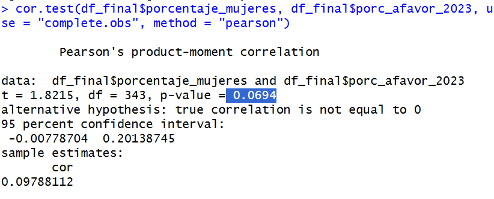

## Unir las bases de datos

Limpiar la base de datos de las elecciones y luego limpiar las bases de datos de CASEN para saber bien que variables vamos a usar.

# Insertar librerías que vamos a usar

```{r}
library(tidyverse)
library(readxl)
library(janitor)
library(dplyr)
library(stringi)
```

# Código para limpiar base 1: Elecciones

```{r}
# Subir bases de datos
pleb_2022 <- read_excel("input/Resultados-Plebiscito-Constitucional-2022.xlsx")
pleb_2023 <- read_excel("input/2023_PlebiscitoConstitucional_DatosPlebiscito.xlsx")

# Limpiar las bases partiendo por la del plebiscito del 2022
pleb_2022 <- clean_names(pleb_2022) |> 
  select(comuna, opcion, votos_tricel) 

pleb_2022 <- pleb_2022 |> 
  group_by(comuna, opcion) |>
  summarise(total_votos = sum(votos_tricel, na.rm = TRUE)) |>
  ungroup()

pleb_2022 <- pleb_2022 |>
  pivot_wider(
    names_from = opcion,
    values_from = total_votos,
    values_fill = 0
  )

pleb_2022 <- clean_names(pleb_2022) |> 
  select(comuna, apruebo, rechazo, votos_en_blanco, votos_nulos)

pleb_2022 <- pleb_2022 |> 
  mutate(
    comuna = str_replace_all(comuna, "LLAILLAY", "LLAY-LLAY"),
    comuna = str_replace_all(comuna, "PAIGUANO", "PAIHUANO")
  )

# Limpiar la base del plebiscito del 2023

pleb_2023 <- clean_names(pleb_2023) |> 
  select(comuna, opciones, votos)

pleb_2023 <- pleb_2023 |>
  group_by(comuna, opciones) |>
  summarise(total_votos = sum(votos, na.rm = TRUE)) |>
  ungroup()

pleb_2023 <- pleb_2023 |>
  pivot_wider(
    names_from = opciones,
    values_from = total_votos,
    values_fill = 0
  )

pleb_2023 <- clean_names(pleb_2023)

pleb_2023 <- pleb_2023 |> 
  mutate(
    comuna = str_replace_all(comuna, "LLAILLAY", "LLAY-LLAY"),
    comuna = str_replace_all(comuna, "PAIGUANO", "PAIHUANO")
  )

# Unir las bases

plebs_final <- full_join(
  pleb_2022,
  pleb_2023,
  by = "comuna",
  suffix = c("_2022", "_2023")
)

plebs_final <- plebs_final |> 
  mutate(comuna = str_to_title(comuna))

plebs_final$comuna <- stri_trans_general(plebs_final$comuna, "Latin-ASCII")

plebs_final$comuna <- gsub("\\bDel\\b", "del", plebs_final$comuna)

plebs_final$comuna <- gsub("\\bDe\\b", "de", plebs_final$comuna)


# Guardar la base final limpia de los plebiscitos

write_csv(plebs_final, "data/plebiscitos_limpio.csv")
```

# Código para limpiar base 2

```{r}
#Se ocupan las mismas librerías

#Subir bases de datos: 

Nivel_educación <- read_xlsx("input/P7_Educacion_2.xlsx") 

Sexo_educación <- read_xlsx("input/P7_Educacion_4.xlsx")

#Limpiamos las bases, comenzamos con Nivel_educación

Nivel_educación <- clean_names(Nivel_educación) |> 
  select(comuna, poblacion_censada, nunca_asistio, diferencial, parvularia, basica, media, superior, nivel_educativo_no_declarado) |>
  filter(!is.na(comuna)) |> 
  filter(!grepl("País", comuna, ignore.case = TRUE))

Nivel_educación$comuna <- stri_trans_general(Nivel_educación$comuna, "Latin-ASCII")  
 
#Limpiamos base de datos Sexo_educación

Sexo_educación <- clean_names(Sexo_educación) |> 
  select(comuna, sexo, 
         anos_de_escolaridad_promedio_para_la_poblacion_de_18_anos_o_mas) |>
  filter(!grepl("Total", sexo, ignore.case = TRUE) & !is.na(comuna)) |> 
   filter(!grepl("País", comuna, ignore.case = TRUE))


Sexo_educación <- Sexo_educación |>
  mutate(
    sexo = str_to_lower(sexo),   
    sexo = case_when(
      sexo == "hombre" ~ "escolaridad_promedio_hombres_18_mas",
      sexo == "mujer"  ~ "escolaridad_promedio_mujeres_18_mas",
      TRUE ~ sexo
    )
  ) |>
  pivot_wider(
    names_from = sexo,
    values_from = anos_de_escolaridad_promedio_para_la_poblacion_de_18_anos_o_mas
  )

Sexo_educación$comuna <- stri_trans_general(Sexo_educación$comuna, "Latin-ASCII")
  
#Ahora ocuparemos edad y genero en una nueva base de datos

edad_comuna <- read_xlsx("input/D1_Poblacion-censada-por-sexo-y-edad-en-grupos-quinquenales.xlsx", sheet = "4", skip = 3)

#Limpiamos base edad_comuna

edad_comuna <- clean_names(edad_comuna) |> 
  select(comuna, grupos_de_edad, poblacion_censada, hombres, mujeres, razon_hombre_mujer) |>
  filter(!grepl("País", comuna, ignore.case = TRUE) & !is.na(comuna)) |> 
  filter(!grupos_de_edad %in% c("0 a 4", "5 a 9", "10 a 14", "15 a 19"))

edad_comuna |> 
  count(grupos_de_edad)

#Falta agregar porcentaje y unir grupos de edad

edad_comuna <- clean_names(edad_comuna) |> 
  select(comuna, grupos_de_edad, poblacion_censada, hombres, mujeres, razon_hombre_mujer) |>
  filter(!grepl("País", comuna, ignore.case = TRUE) & !is.na(comuna)) |>
  filter(!grupos_de_edad %in% c("0 a 4", "5 a 9", "10 a 14", "15 a 19")) |>
  mutate(
    grupo_edad_unido = case_when(
      grupos_de_edad %in% c("20 a 24", "25 a 29", "30 a 34") ~ "20 a 34",
      grupos_de_edad %in% c("35 a 39", "40 a 44", "45 a 49") ~ "35 a 49",
      grupos_de_edad %in% c("50 a 54", "55 a 59", "60 a 64") ~ "50 a 64",
      grupos_de_edad %in% c("65 a 69", "70 a 74", "75 a 79") ~ "65 a 79",
      grupos_de_edad %in% c("80 a 84", "85 a 89", "90 a 94", "95 a 99", "100 y más") ~ "80 y más",
      TRUE ~ grupos_de_edad
    )
  ) |>
  group_by(comuna, grupo_edad_unido) |>
  summarise(
    poblacion_censada = sum(poblacion_censada),
    hombres = sum(hombres),
    mujeres = sum(mujeres),
    .groups = "drop"
  ) |>
  mutate(
    porcentaje_hombres = round((hombres / poblacion_censada) * 100, 2),
    porcentaje_mujeres = round((mujeres / poblacion_censada) * 100, 2)
  ) 

#Ahora hay que colocar cual es el mayor grupo  

  edad_comuna <- edad_comuna |>
  group_by(comuna) |>
   filter(!grepl("Total Comuna", grupo_edad_unido, ignore.case = TRUE)) |>
  filter(poblacion_censada == max(poblacion_censada)) |>
  ungroup()|>
  select(comuna, grupo_edad_unido, poblacion_censada, hombres, mujeres, porcentaje_hombres, porcentaje_mujeres)
  
 edad_comuna$comuna <- stri_trans_general(edad_comuna$comuna, "Latin-ASCII")

  #Los rangos etarios se renombrarán
  
  edad_comuna <- edad_comuna |> 
    mutate(
      grupo_edad_unido = case_when(
        grupo_edad_unido == "20 a 34" ~ "1",
        grupo_edad_unido == "35 a 49" ~ "2",
        grupo_edad_unido == "50 a 64" ~ "3",
        grupo_edad_unido == "65 a 79" ~ "4",
        grupo_edad_unido == "80 y más" ~ "5",
        TRUE ~ grupo_edad_unido
      )
    )
  
 write_csv(Sexo_educación,"data/Sexo_educación.csv") 
 
 write_csv(Nivel_educación,"data/Nivel_educación.csv")
 
```

# Código para limpiar base 3: Tendencia política de la comuna

```{r}
alcaldes <- read_excel("input/datos_alcalde.xlsx")

alcaldes <- clean_names(alcaldes)

alcaldes <- alcaldes |>
  filter(cargo == "ALCALDE")

alcaldes <- alcaldes |> 
  select(comuna,pacto, partido) |> 
  arrange(comuna)

alcaldes <- alcaldes |> 
  mutate(
    comuna  = comuna  |> stri_trans_general("Latin-ASCII") |> str_to_lower() |> str_to_title(),
    pacto   = pacto   |> stri_trans_general("Latin-ASCII") |> str_to_lower() |> str_to_title(),
    partido = partido |> stri_trans_general("Latin-ASCII") |> str_to_lower() |> str_to_title()
  )

alcaldes$comuna <- gsub("\\bDel\\b", "del", alcaldes$comuna)

alcaldes$comuna <- gsub("\\bDe\\b", "de", alcaldes$comuna)

write_csv(alcaldes, "data/tendencia.csv")
```

Nivel socioeconómico de la comuna

```{r}

pobreza_comuna <- read_xlsx("input/Estimaciones_Tasa_Pobreza_Ingresos_Comunas_2022.xlsx")

pobreza_comuna <- clean_names(pobreza_comuna)

pobreza_comuna <- pobreza_comuna |> 
  select(nombre_comuna, numero_de_personas_segun_proyecciones_de_poblacion, numero_de_personas_en_situacion_de_pobreza_por_ingresos, porcentaje_de_personas_en_situacion_de_pobreza_por_ingresos_2022) |> 
  filter(!is.na(nombre_comuna)) |> 
  rename(comuna = nombre_comuna)

pobreza_comuna$comuna <- stri_trans_general(pobreza_comuna$comuna, "Latin-ASCII")

pobreza_comuna$comuna <- gsub("\\bDel\\b", "del", pobreza_comuna$comuna)

pobreza_comuna$comuna <- gsub("\\bDe\\b", "de", pobreza_comuna$comuna)
 
write_csv(pobreza_comuna, "data/pobreza_comuna.csv") 

```

# Unir todas las bases limpias

```{r}

BASE_FINAL <- plebs_final |> 
  full_join(pobreza_comuna, by = "comuna") |> 
  full_join(alcaldes, by = "comuna") |> 
  full_join(edad_comuna, by = "comuna") |> 
  full_join(Nivel_educación, by = "comuna") |> 
  full_join(Sexo_educación, by = "comuna")

BASE_FINAL <- BASE_FINAL |> 
  mutate(
    comuna = case_when(
      comuna == "Paiguano" ~ "Paihuano",
      comuna == "Llay-Llay" ~ "Llay Llay",
      comuna == "Marchigue" ~ "Marchihue",
      comuna == "Cabo de Hornos" ~ "Cabo de Hornos(Ex-Navarino)",
      comuna == "San Pedro de La paz" ~ "San Pedro de la paz",
      comuna == "San Juan de la Costa" ~ "San Juan de La Costa",
      comuna == "O'higgins" ~ "O'Higgins",
      comuna == "Treguaco" ~ "Trehuaco",
      TRUE ~ comuna
    )
  )

BASE_FINAL <- BASE_FINAL |> 
  group_by(comuna) |> 
  summarise(across(everything(), ~ dplyr::first(na.omit(.x))), .groups = "drop")

BASE_FINAL_LISTA <- BASE_FINAL |>
  filter(!is.na(comuna)) |>
  filter(comuna != "Antartica")

write_csv(BASE_FINAL_LISTA, "data/base_final_lista.csv")
```

# Unas últimas modificaciones antes de hacer las regresiones

```{r}
df_final <- read_csv("data/base_final_lista.csv")

df_final <- df_final |>
  mutate(pleb_2022_bin = ifelse(apruebo > rechazo, 1, 0 ) |> as.factor())

df_final <- df_final |> 
  mutate(pleb_2023_bin = ifelse(a_favor > en_contra, 1, 0) |> as.factor())

df_final <- df_final |> 
  mutate(
    tendencia = case_when(
      pacto %in% c("Chile Vamos", "Unidos Por La Dignidad") ~ "Derecha",
      pacto %in% c("Unidad Por El Apruebo", "Frente Amplio", "Chile Digno Verde Y Soberano", "Dignidad Ahora") ~ "Izquierda",
      pacto == "Independientes" ~ "Independiente",
      TRUE ~ "Otro"
    )
  )
```

# Ahora si regresiones

```{r}
modelo_2022 <- glm(df_final$pleb_2022_bin ~ df_final$escolaridad_promedio_hombres_18_mas + df_final$escolaridad_promedio_mujeres_18_mas + df_final$tendencia + df_final$numero_de_personas_en_situacion_de_pobreza_por_ingresos + df_final$grupo_edad_unido,
                   data = df_final,
                   family = binomial(link = "logit"))
```

```{r}
modelo_2023 <- glm(df_final$pleb_2023_bin ~ df_final$escolaridad_promedio_hombres_18_mas + df_final$escolaridad_promedio_mujeres_18_mas + df_final$tendencia + df_final$porcentaje_de_personas_en_situacion_de_pobreza_por_ingresos_2022 + df_final$grupo_edad_unido,
                   data = df_final,
                   family = binomial(link = "logit"))
```

# Ahora toca graficar: Cargaremos librearías que aún no han sido cargadas

```{r}
library(tidyverse) 
library(sf) 
library(chilemapas)
library(janitor)
library(gganimate)
library(plotly)
library(ggplot2)
```

# Unimos bases para tener códigos

```{r}
cut_data <- read_xls("input/CUT_2018_v04.xls") |> 
  clean_names() |> 
  select(codigo_comuna_2018, nombre_comuna) |> 
  rename(comuna = nombre_comuna) |> 
  mutate(comuna = stri_trans_general(comuna, "Latin-ASCII")) |> 
  mutate(
    comuna = case_when(
      comuna == "Paiguano" ~ "Paihuano",
      comuna == "Llay-Llay" ~ "Llay Llay",
      comuna == "Marchigue" ~ "Marchihue",
      comuna == "Cabo de Hornos" ~ "Cabo de Hornos(Ex-Navarino)",
      comuna == "San Pedro de La paz" ~ "San Pedro de la paz",
      comuna == "San Juan de La Costa" ~ "San Juan de la Costa",
      comuna == "O'higgins" ~ "O'Higgins",
      comuna == "Treguaco" ~ "Trehuaco",
      TRUE ~ comuna
    )
  )
  
df_final <- df_final |> 
  left_join(cut_data, by = "comuna")


summary(df_final)
```

##Gráficos

# Gráfico rpomedio de años de escolaridad para el APRUEBO:

#1.Mujeres

```{r}
  ggplot(
    m_escolaridad_promedio, 
    aes(
      x = escolaridad_promedio_mujeres_18_mas,
      y = porc_apruebo_2022
    )
  ) +
  geom_point(color = "#8B1C62", size = 2, alpha = 0.7) +
    geom_smooth(method = "lm") +
  geom_text(
    data = m_escolaridad_promedio %>% 
      filter(
        porc_apruebo_2022 < 24  &
          escolaridad_promedio_mujeres_18_mas > 14
      ),
    aes(label = comuna),
    size = 2.5,
    color = "black",
    check_overlap = TRUE,
    nudge_y = 0.01
  ) +
    scale_y_continuous(limits = c(0, 100)) +
  labs(
    title = "Escolaridad promedio de mujeres (18+) y apoyo al Apruebo 2022",
    x = "Años de escolaridad promedio mujeres 18+",
    y = "Porcentaje Apruebo 2022"
  ) +
  theme_minimal() +
  theme(
    plot.title = element_text(size = 13, face = "bold"),
    axis.title = element_text(size = 11)
  )
```

#2.Hombres

```{r}

  ggplot(
    m_escolaridad_promedio, 
    aes(
      x = escolaridad_promedio_hombres_18_mas,
      y = porc_apruebo_2022
    )
  ) +
    geom_point(color = "turquoise4", size = 2, alpha = 0.7) +
    geom_smooth(method = "lm") +
    geom_text(
      data = m_escolaridad_promedio %>% 
        filter(
          porc_apruebo_2022 < 25 &
            escolaridad_promedio_mujeres_18_mas > 14
        ),
      aes(label = comuna),
      size = 2.5,
      color = "black",
      check_overlap = TRUE,
      nudge_y = 0.01
    ) +
    scale_y_continuous(limits = c(0, 100)) +
    labs(
      title = "Escolaridad promedio de hombres (18+) y apoyo al apruebo 2022",
      x = "Años de escolaridad promedio hombres 18+",
      y = "Porcentaje Apruebo 2022"
    ) +
    theme_minimal() +
    theme(
      plot.title = element_text(size = 13, face = "bold"),
      axis.title = element_text(size = 11)
    )  
```

#2 Años de escolaridad y porcentaje de votod a favor

#1.Mujer

```{r}
ggplot(
    df_final, 
    aes(
      x = escolaridad_promedio_mujeres_18_mas,
      y = porc_afavor_2023
    )
  ) +
  geom_point(color = "#8B1C62", size = 2, alpha = 0.7) +
    geom_smooth(method = "lm") +
  geom_text(
    data = df_final %>% 
      filter(
        porc_afavor_2023 > 65 &
          escolaridad_promedio_mujeres_18_mas > 14
      ),
    aes(label = comuna),
    size = 2.5,
    color = "black",
    check_overlap = TRUE,
    nudge_y = 0.01
  ) +
    scale_y_continuous(limits = c(0, 100)) +
  labs(
    title = "Escolaridad promedio de mujeres (18+) y apoyo al Afavor 2023",
    x = "Años de escolaridad promedio mujeres 18+",
    y = "Porcentaje Afavor 2023"
  ) +
  theme_minimal() +
  theme(
    plot.title = element_text(size = 13, face = "bold"),
    axis.title = element_text(size = 11)
  )
```

#2.Hombres

```{r}

  ggplot(
    df_final, 
    aes(
      x = escolaridad_promedio_hombres_18_mas,
      y = porc_afavor_2023
    )
  ) +
    geom_point(color = "turquoise4", size = 2, alpha = 0.7) +
    geom_smooth(method = "lm") +
    geom_text(
      data = df_final%>% 
        filter(
          porc_afavor_2023 > 50 &
            escolaridad_promedio_hombres_18_mas > 15
        ),
      aes(label = comuna),
      size = 2.5,
      color = "black",
      check_overlap = TRUE,
      nudge_y = 0.01
    ) +
    scale_y_continuous(limits = c(0, 100)) +
    labs(
      title = "Escolaridad promedio de hombres (18+) y apoyo al Afavor 2023",
      x = "Años de escolaridad promedio hombres 18+",
      y = "Porcentaje Afavor 2023"
    ) +
    theme_minimal() +
    theme(
      plot.title = element_text(size = 13, face = "bold"),
      axis.title = element_text(size = 11)
    )  
```

```{r}
#Correlación

cor.test(df_final$escolaridad_promedio_mujeres_18_mas, df_final$porc_afavor_2023, use = "complete.obs", method = "pearson")

```

#es significativa porque es menor a o.5

```{r}
cor.test(df_final$escolaridad_promedio_mujeres_18_mas, df_final$porc_afavor_2023, use = "complete.obs", method = "pearson") 

#esto entrega un valor p, el cual es menor a 0.5
```

#3 porcentaje de pobreza y porcentaje de votos

#APRUEBO 2022

```{r}
  ggplot(
    m_escolaridad_promedio, 
    aes(
      x = porcentaje_de_personas_en_situacion_de_pobreza_por_ingresos_2022,
      y = porc_apruebo_2022
    )
  ) +
    
    # Puntos
    geom_point(color = "#FF8C00", size = 2, alpha = 0.7) +
    geom_smooth(method = "lm") +
    geom_text(
      data = m_escolaridad_promedio %>%
        filter(
            porc_apruebo_2022 < 23 &
            porcentaje_de_personas_en_situacion_de_pobreza_por_ingresos_2022 < 0.05
        ),
      aes(label = comuna),
      size = 2.5,
      color = "black",
      check_overlap = TRUE,
      nudge_y = 0.01
    ) +
    scale_y_continuous(limits = c(0, 100)) +
    labs(
      title = "Pobreza",
      x = "Porcentaje de pobreza",
      y = "Porcentaje Apruebo 2022"
    ) +
    theme_minimal() +
    theme(
      plot.title = element_text(size = 13, face = "bold"),
      axis.title = element_text(size = 11)
    )
```

# AFAVOR 2023

```{r}
  ggplot(
    m_escolaridad_promedio, 
    aes(
      x = porcentaje_de_personas_en_situacion_de_pobreza_por_ingresos_2022,
      y = porc_afavor_2023
    )
  ) +
    
    # Puntos
    geom_point(color = "#CD5B45", size = 2, alpha = 0.7) +
    geom_smooth(method = "lm") +
    geom_text(
      data = m_escolaridad_promedio %>%
        filter(
            porc_afavor_2023 > 60 &
            porcentaje_de_personas_en_situacion_de_pobreza_por_ingresos_2022 < 0.05
        ),
      aes(label = comuna),
      size = 2.5,
      color = "black",
      check_overlap = TRUE,
      nudge_y = 0.01
    ) +
    scale_y_continuous(limits = c(0, 100)) + 
    labs(
      title = "Pobreza",
      x = "Porcentaje de pobreza",
      y = "Porcentaje Afavor 2023"
    ) +
    theme_minimal() +
    theme(
      plot.title = element_text(size = 13, face = "bold"),
      axis.title = element_text(size = 11)
    )
```

#3. porcentaje de mujeres u hombres en la población: AFAVOR

arreglar porcentaje
#Mujeres

```{r}
#1.Mujer

ggplot(
    df_final, 
    aes(
      x = porcentaje_mujeres,
      y = porc_afavor_2023
    )
  ) +
  geom_point(color = "#8B1C62", size = 2, alpha = 0.7) +
    geom_smooth(method = "lm") +
  geom_text(
    data = df_final %>% 
      filter(
        porc_afavor_2023 > 65 &
          porcentaje_mujeres > 14
      ),
    aes(label = comuna),
    size = 2.5,
    color = "black",
    check_overlap = TRUE,
    nudge_y = 0.01
  ) +
    scale_y_continuous(limits = c(0, 100)) +
  labs(
    title = "porcentaje de mujeres y apoyo al Afavor 2023",
    x = "porcentaje de mujeres",
    y = "Porcentaje Afavor 2023"
  ) +
  theme_minimal() +
  theme(
    plot.title = element_text(size = 13, face = "bold"),
    axis.title = element_text(size = 11)
  )
```

No se ve tanto sentido con lo que se vota a favor,

```{r}
#Correlación

cor.test(df_final$porcentaje_mujeres, df_final$porc_afavor_2023, use = "complete.obs", method = "pearson")

```



Se descubre que no hay relación alguna

#2.Hombres

```{r}

  ggplot(
    df_final, 
    aes(
      x = porcentaje_hombres,
      y = porc_afavor_2023
    )
  ) +
    geom_point(color = "turquoise4", size = 2, alpha = 0.7) +
    geom_smooth(method = "lm") +
    geom_text(
      data = df_final%>% 
        filter(
          porc_afavor_2023 > 70 &
            porcentaje_hombres < 60
        ),
      aes(label = comuna),
      size = 2.5,
      color = "black",
      check_overlap = TRUE,
      nudge_y = 0.01
    ) +
    scale_y_continuous(limits = c(0, 100)) +
    labs(
      title = "porcentaje de hombres y apoyo al Afavor 2023",
      x = "porcentaje de hombres",
      y = "Porcentaje Afavor 2023"
    ) +
    theme_minimal() +
    theme(
      plot.title = element_text(size = 13, face = "bold"),
      axis.title = element_text(size = 11)
    )  
```

#4.porcentaje de mujeres u hombres en la población: APRUEBO

#Mujeres

```{r}

ggplot(
    df_final, 
    aes(
      x = porcentaje_mujeres,
      y = porc_apruebo_2022
    )
  ) +
  geom_point(color = "#8B1C62", size = 2, alpha = 0.7) +
    geom_smooth(method = "lm") +
  geom_text(
    data = df_final %>% 
      filter(
        porc_apruebo_2022 < 15 &
          porcentaje_mujeres > 45
      ),
    aes(label = comuna),
    size = 2.5,
    color = "black",
    check_overlap = TRUE,
    nudge_y = 0.01
  ) +
    scale_y_continuous(limits = c(0, 100)) +
  labs(
    title = "porcentaje de mujeres y apoyo al Apruebo 2022",
    x = "porcentaje de mujeres",
    y = "Porcentaje Apruebo 2022"
  ) +
  theme_minimal() +
  theme(
    plot.title = element_text(size = 13, face = "bold"),
    axis.title = element_text(size = 11)
  )

```

#2.Hombres

```{r}

  ggplot(
    df_final, 
    aes(
      x = porcentaje_hombres,
      y = porc_apruebo_2022
    )
  ) +
    geom_point(color = "turquoise4", size = 2, alpha = 0.7) +
    geom_smooth(method = "lm") +
    geom_text(
      data = df_final%>% 
        filter(
          porc_apruebo_2022 < 16 &
            porcentaje_hombres < 60
        ),
      aes(label = comuna),
      size = 2.5,
      color = "black",
      check_overlap = TRUE,
      nudge_y = 0.01
    ) +
    scale_y_continuous(limits = c(0, 100)) +
    labs(
      title = "porcentaje de hombres y apoyo al Apruebo 2022",
      x = "porcentaje de hombres",
      y = "Porcentaje Apruebo 2022"
    ) +
    theme_minimal() +
    theme(
      plot.title = element_text(size = 13, face = "bold"),
      axis.title = element_text(size = 11)
    )  
```


#5.